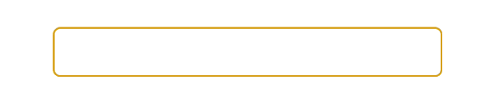

# Angular Rainbow

Angular application that uses a directive (RainbowDirective) to listen for a keydown event on the host and sets its text and border color to a random color from a set of a few available colors when user is typing.

## Below is the directive in action

